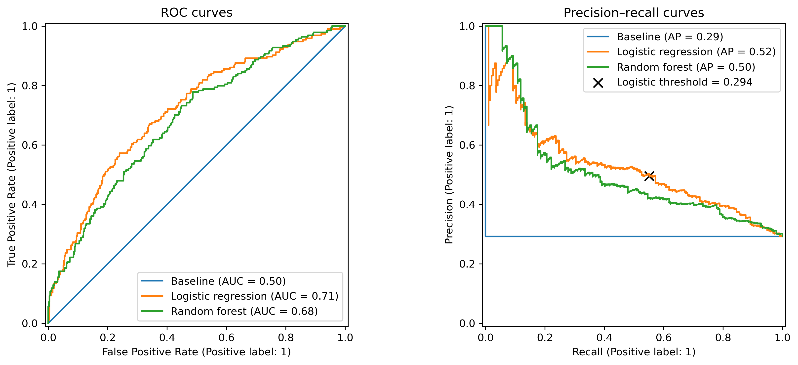

# SQL-to-ML Retail Analytics Workflow

## Overview

This project presents an end-to-end data science workflow connecting PostgreSQL feature engineering with Python-based machine learning. The UCI Online Retail dataset is downloaded and imported into PostgreSQL. The retail transactions are then cleaned and aggregated through reproducible SQL, and the resulting customer-level dataset is loaded into pandas. A majority-class baseline, logistic regression, and a random forest are compared to predict future purchases from past customer behavior. The repository also contains preliminary SQL, Python, and R integration exercises.


## Business question

Can we predict which eligible customers will make a valid purchase during September 2011 using only their purchase behavior before 1 September 2011?

An eligible customer is one who made at least one valid purchase before the snapshot date.


## Dataset

The project uses the [UCI Online Retail dataset](https://archive.ics.uci.edu/dataset/352/online+retail), containing 541,909 invoice-line records from a UK-based online retailer between December 2010 and December 2011. The variables describe invoices, products, quantities, prices, transaction dates, customers, and countries.

The raw transactions are imported into PostgreSQL and transformed into an analytical view containing deduplicated, customer-linked records classified as purchases, returns or cancellations, and other transactions. SQL then aggregates the historical transactions into a snapshot of 3,317 eligible customers.

The final snapshot contains 11 columns: a customer identifier, historical customer features, audit variables, and the binary target. Seven features are used for modelling; identifier, date, and redundant monetary columns are retained for validation but excluded from model training.

The Excel file is not included in the repository and must be downloaded separately from UCI.

## Workflow

```text
UCI Excel dataset
→ Python import
→ PostgreSQL raw table
→ SQL cleaning and analytical view
→ SQL customer snapshot and target
→ pandas validation and exploratory analysis
→ scikit-learn modelling and evaluation
```

1. Python imports the raw Excel file into PostgreSQL.
2. SQL profiles the data, removes exact duplicates from the analytical layer, handles unidentified customers and accounting adjustments, and distinguishes purchases from returns.
3. SQL creates one row per eligible customer using activity before 1 September 2011 and defines the target using purchases during September.
4. pandas loads and validates the resulting customer snapshot.
5. scikit-learn compares a majority-class baseline, logistic regression, and random forest using stratified splitting and cross-validation.
6. Out-of-fold training probabilities are used to select a classification threshold before final evaluation on the held-out test set.


## Feature Engineering

Features included in the final snapshot: 

| Feature              | Definition                                        |
| -------------------- | ------------------------------------------------- |
| `recency_days`       | Days since the customer’s latest valid purchase   |
| `order_count`        | Number of distinct valid purchase invoices        |
| `gross_spend`        | Total value of valid purchases before returns     |
| `total_items`        | Total number of purchased units                   |
| `unique_products`    | Number of distinct purchased products             |
| `return_order_count` | Number of return or cancellation invoices         |
| `returned_value`     | Total monetary value of returns and cancellations |


- All features use transactions before 1 September 2011.
- The target uses valid purchases from 1 September to 1 October.
- `net_spend` is retained for auditing but excluded from modelling because it is exactly derived from `gross_spend - returned_value`.
- `customer_id` and `last_purchase_date` are also excluded from modelling.


## Models and evaluation

Three classifiers were compared:

* a majority-class dummy baseline;
* logistic regression with logarithmic transformation and standardization of the seven predictors;
* a random forest classifier.

The data were divided into stratified training and test subsets. Candidate models were compared using five-fold cross-validation on the training subset. Performance was assessed using accuracy, balanced accuracy, precision, recall, F1, ROC AUC, and average precision.

After selecting logistic regression, out-of-fold training probabilities were used to choose a classification threshold that maximized F1. The held-out test subset was reserved for final evaluation.

## Results

Logistic regression performed modestly but consistently better than the random forest during cross-validation. It achieved mean ROC AUC of 0.741 and average precision of 0.612, compared with 0.721 and 0.584 for the random forest. Both models substantially outperformed the majority-class baseline. Logistic regression was selected as the primary model because it also offered greater simplicity and interpretability.

The training-side threshold-selection procedure identified a probability threshold of 0.294. On the held-out test set, this threshold increased recall from 0.273 to 0.552 and F1 from 0.364 to 0.522 compared with the default threshold of 0.5. Precision decreased from 0.546 to 0.495, reflecting the expected trade-off between identifying more purchasers and generating more false positives.

At the selected threshold, the final model achieved a test balanced accuracy of 0.660, ROC AUC of 0.713, and average precision of 0.523.




## Repository structure

## Repository structure

```text
sql-ds-workflow/
├── data/
│   └── raw/
│       └── .gitkeep
├── notes/
│   └── part3_sql_learning.md
├── python/
│   ├── 01_connect_to_database.py
│   ├── 02_sqlalchemy_query.py
│   ├── 03_import_online_retail.py
│   └── 04_customer_purchase_model.py
├── R/
│   └── 01_dbplyr_query.R
├── reports/
│   └── figures/
│       └── model_evaluation_curves.png
├── sql/
│   ├── 01_create_database.sql
│   ├── 02_create_tables.sql
│   ├── 03_insert_data.sql
│   ├── 04_analytics.sql
│   ├── 05_create_online_retail_table.sql
│   ├── 06_data_quality_checks.sql
│   ├── 07_create_analytical_view.sql
│   ├── 08_single_snapshot_features.sql
│   ├── 09_validate_customer_snapshot.sql
│   └── 99_customer_snapshots.sql
├── .gitignore
├── environment.yml
└── README.md
```

The numbered SQL and Python files follow the intended execution order. Files `01`–`04` contain the preliminary shop-database and cross-language integration exercises. Files `05` onward implement the Online Retail prediction workflow. `99_customer_snapshots.sql` is reserved for the planned multi-snapshot extension.

## How to reproduce the project

1. Clone the repository.
2. Install PostgreSQL and the required Python dependencies.
3. Download `Online Retail.xlsx` from the [UCI Online Retail dataset page](https://archive.ics.uci.edu/dataset/352/online+retail) and place it in `data/raw/`.
4. Set the `POSTGRES_PASS` environment variable to the password for the local PostgreSQL user.
In PowerShell, the password can be set for the current terminal session with:

```powershell
$env:POSTGRES_PASS = "your_postgresql_password"
```

5. Run `sql/01_create_database.sql` to create the `shop` database.
6. Connect to `shop` and run `sql/05_create_online_retail_table.sql`.
7. Run `python/03_import_online_retail.py` to import the raw dataset.
8. Run SQL files `06` through `09` in numerical order to profile the data and create the analytical and customer-snapshot views.
9. Run `python/04_customer_purchase_model.py` to reproduce the analysis, model comparison, threshold selection, and evaluation figure.


Create and activate the Conda environment:

```powershell
conda env create -f environment.yml
conda activate sql-ds-workflow
```

SQL files `02` through `04` and Python files `01` and `02` belong to the preliminary shop-database exercises and are not required to reproduce the Online Retail model.

## Limitations and future work

* The analysis uses a single snapshot date and therefore relies on a stratified random train/test split rather than temporal validation.
* The data cover one retailer and approximately one year, limiting generalizability to other businesses and periods.
* Many customers are wholesalers, producing highly skewed purchasing behaviour and extreme but potentially valid values.
* The selected probability threshold maximizes F1 rather than an explicitly defined business value or campaign cost.
* The predictors are limited to aggregated transactional behaviour and omit potentially useful customer, product, and seasonal information.
* Features accumulate activity over the complete pre-snapshot period. Recent-window features could better distinguish currently active customers from formerly frequent but inactive customers.

Future work could implement the multi-snapshot design outlined in `sql/99_customer_snapshots.sql`, enabling temporal validation and features such as orders and spending during the preceding 30 or 90 days.

## Learning notes

The project was also used to consolidate several SQL and data-engineering concepts:

* data grain;
* tables and views;
* common table expressions;
* aggregation and conditional aggregation;
* `LEFT JOIN` and `COALESCE`;
* temporal cutoffs and data leakage.

Detailed notes are available in [Part 3 SQL learning notes](notes/part3_sql_learning.md).

## AI assistance

This project was developed with extensive assistance from OpenAI generative AI tools for instruction, code review, debugging, and documentation editing. The code was executed, tested, revised, and interpreted by the repository author, who remains responsible for the final implementation and conclusions.
